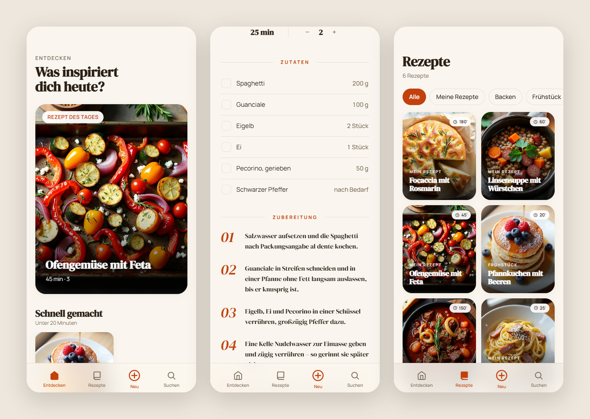
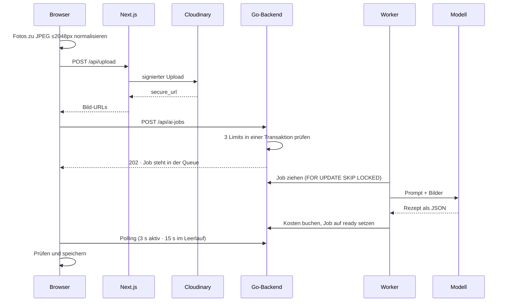

# Kochbuch

Ein privates Rezeptarchiv mit Bild-zu-Rezept-Pipeline: Foto rein, strukturierter Datensatz raus.

Benutzt wird die App fast ausschließlich am Handy, in der Küche, mit einer Hand, während
nebenher etwas auf dem Herd steht. Danach ist sie auch gebaut.

Sie läuft seit Mai 2026 im Eigenbetrieb auf einem eigenen Server. Ich benutze sie fast
täglich, fünf weitere Leute etwa wöchentlich.



*Entdecken, Rezept, Liste, also der Alltag der App. Auf dem Desktop läuft ein eigenes
Layout und nicht dasselbe zusammengeschoben, zu sehen weiter unten beim Admin-Bereich. Die
Rezepte in den Screenshots sind Beispieldaten.*

## Das Problem

Rezepte sammeln sich als Handyfotos, Screenshots und Links an. In der Form sind sie weder
durchsuchbar noch sortierbar, und beim Kochen taugen sie wenig, weil man durch eine Galerie
scrollt und nach dem richtigen Bild sucht.

Die App macht daraus strukturierte Datensätze mit getrennten Mengen und Einheiten,
nummerierten Zubereitungsschritten, Kategorie, Zeit und Portionen. Als Eingabe reicht ein
Foto einer Kochbuchseite.

Und weil jedes Rezept ein eigener Datensatz ist, gehört es einem wirklich. Ist ein Schritt
in der Vorlage unklar beschrieben, schreibt man ihn in der eigenen Fassung so, dass er zu
einem passt. Findet man beim Kochen einen Trick heraus, schreibt man ihn direkt ins
Rezept. So werden die Rezepte mit der Zeit besser und nicht nur mehr.

## Was sie kann

- **Auf dem Handy wie eine App.** Eigene Tab-Navigation unten, über den Startbildschirm
  installierbar, im Standalone-Modus ohne Browserleiste. Offline funktioniert sie
  allerdings nicht, weil es keinen Service Worker gibt.
- **Zutaten und Schritte abhaken** beim Kochen. Beides ist antippbar und mit dem Daumen
  erreichbar.
- **Portionsrechner.** Die Zutatenmengen skalieren mit der Personenzahl. Angaben ohne Zahl
  wie „nach Bedarf" bleiben unangetastet.
- **Rezept aus Fotos erzeugen.** Bis zu sechs Aufnahmen gleichzeitig, direkt aus der
  Handykamera. Ein Modell liest sie aus und füllt ein Formular vor, das man vor dem
  Speichern prüft.
- **Nährwerte pro Portion**, geschätzt und als solche gekennzeichnet. Wie genau diese
  Schätzung ist, steht weiter unten.
- **Geteilte und eigene Rezepte.** Was ein Admin anlegt, sehen alle. Was ein Nutzer
  anlegt, sieht nur er selbst.
- **Suche über Titel und Zutaten**, unscharf und direkt im Browser.
- **Zugang nur auf Einladung.** Eine Registrierung gibt es nicht, ein Admin trägt die
  Adressen ein.

## Wie sie gebaut ist

**Backend** ist Go 1.26 mit [chi](https://github.com/go-chi/chi) als Router,
[pgx](https://github.com/jackc/pgx) auf PostgreSQL und [goose](https://github.com/pressly/goose)
für die Migrationen. Von den 30 HTTP-Endpunkten verlangen 26 eine Anmeldung, und die Hälfte
davon verlangt zusätzlich Admin-Rechte. Ohne Anmeldung erreichbar sind nur vier, nämlich
An- und Abmelden, das Anfordern der Passwort-Einrichtungsmail und ein Health-Check für den
Betrieb.

**Frontend** ist Next.js 16 mit React 19, TypeScript und Tailwind 4, verteilt auf 16
Seitenrouten.

**Betrieb** läuft über docker-compose mit Postgres, Backend und
[Caddy](https://caddyserver.com) als Reverse Proxy mit automatischem TLS. Die Container-Images kommen
über GHCR, das Deployment über einen self-hosted Runner. Die Rezeptbilder liegen nicht im
Container, sondern bei Cloudinary. Postgres hängt bewusst auf
`127.0.0.1` statt auf `0.0.0.0`, weil das Backend die Datenbank im Betrieb über das
Docker-Netz erreicht und der Port von außen nicht ansprechbar sein soll.

Vier Entscheidungen, die sich begründen lassen:

**Getrennte Layouts statt eines responsiven Baums.** Sieben Dateien rendern die Mobil- und
die Desktop-Variante getrennt über `lg:hidden` und `hidden lg:block`. Die Startseite ist am
Handy nicht dieselbe Seite in schmal, sondern beginnt mit „Was inspiriert dich heute?" und
einer Bildkachel, während auf dem Desktop ein breiter Aufmacher steht. Das kostet
Duplikate, denn die Sektionslogik steht an zwei Stellen, und wer eine Sektion ändert, muss
an beide denken. Bei einer App, die fast nur am Handy benutzt wird, war mir eine echte
Handy-Oberfläche das wert. Dazu kommen Details wie die Wischgeste auf dem Rezeptbild, die
nach zehn Pixeln einmalig klassifiziert, ob sie ein Ziehen ist oder Safaris
Zurück-Wischen, wobei die 28 Pixel am Bildschirmrand unangetastet bleiben, damit die
Systemgeste weiter funktioniert.

**Eigene Sitzungen statt Firebase-Sitzung.** Die Anmeldung läuft über Firebase
Authentication, mit Google-Konto oder mit E-Mail und Passwort. Firebase beantwortet dabei
aber nur die Frage, wer jemand ist. Ob die Person hereindarf, entscheidet das Backend
anhand der Tabelle `users`, und wer dort nicht eingetragen ist, bekommt eine Absage. Nach
der Prüfung legt das Backend eine eigene Sitzung an, also 32 zufällige Bytes in der
Datenbank und ein Cookie, das 30 Tage gilt. Für die laufende Sitzung spielt Firebase damit
keine Rolle mehr, und dadurch wirkt zum Beispiel ein Deaktivieren im Admin-Bereich sofort,
weil jede Anfrage gegen die eigene Datenbank geprüft wird. Dazu kommen zwei Regeln: Eine
E-Mail-Adresse ist dauerhaft entweder eine Google-Adresse oder eine Passwort-Adresse,
damit niemand eine eingeladene Adresse über den zweiten Weg übernimmt, und wer die falsche
Methode benutzt, bekommt einen Hinweis auf die richtige. Außerdem hat ein normales Konto
höchstens eine aktive Sitzung, denn eine Anmeldung auf einem neuen Gerät meldet das alte
Gerät ab. So lohnt es sich nicht, Anmeldedaten an andere weiterzugeben, und ich behalte
die Kontrolle darüber, wer Zugriff auf die App hat. Admins sind davon ausgenommen.

**Kein State-Management-Paket.** In React-Anwendungen brauchen mehrere Komponenten oft
dieselben Daten, etwa wer gerade angemeldet ist. Üblicherweise zieht man dafür eine
Bibliothek wie Redux, Zustand oder React Query ein. Hier kommen 34 Client-Komponenten ohne
so eine Bibliothek aus, weil die eigentlichen Inhalte schon auf dem Server geladen werden
und im Browser nur wenig übrig bleibt. Für den Rest reichen drei kleine Hooks mit
Modul-Cache, `sessionStorage` und einem geteilten Promise, damit fünf Komponenten, die
gleichzeitig dieselbe Information brauchen, nur eine Anfrage auslösen. `useMe` ist dabei 97
Zeilen lang und löst damit das, wofür sonst ein Paket eingezogen wird.

**Jobs in der Datenbank statt im Speicher.** Ein Modell braucht für ein Foto einige
Sekunden, manchmal länger. Würde die Anfrage darauf warten, hinge der Browser an einer
offenen Verbindung, und bei einem Neustart des Servers wäre die Arbeit weg. Stattdessen
wird ein Auftrag als Zeile in der Tabelle `ai_jobs` gespeichert, und die Antwort geht
sofort zurück. Ein Worker-Pool im Hintergrund zieht die Zeilen mit
`SELECT … FOR UPDATE SKIP LOCKED`, wodurch mehrere Worker und auch mehrere
Backend-Instanzen parallel arbeiten können, ohne denselben Job zweimal zu verarbeiten. Wie
das im Ganzen abläuft, zeigt der nächste Abschnitt.

## Vom Foto zum Rezept



Der erste Schritt passiert schon im Browser: iPhone-Fotos von gedruckten Seiten werden auf
JPEG und maximal 2048 px normalisiert, weil sie sonst regelmäßig das Größenlimit des
Servers sprengen.

Der Job durchläuft sechs Zustände, die per CHECK-Constraint in der Datenbank erzwungen
werden: `queued → running → ready → consumed`, dazu `failed` und `cancelled`. Was
dazwischen schiefgehen kann, ist behandelt:

- **Provider-Fehler** führen zu bis zu drei Versuchen, danach geht der Job mit Fehlertext
  auf `failed`.
- **Ein Neustart mitten in der Verarbeitung** setzt beim nächsten Start alle
  hängengebliebenen Jobs zurück. Jobs, die ihre Versuche schon aufgebraucht haben, gehen
  final auf `failed`, weil sonst ein Job, der das Backend zum Absturz bringt, endlos im
  Kreis laufen könnte.
- **Verwirft ein Nutzer ein Ergebnis**, wird der Job nicht gelöscht, sondern auf
  `cancelled` gesetzt. Die Kosten sind beim Anbieter bereits angefallen, und sie aus der
  Statistik verschwinden zu lassen würde die Zahlen stillschweigend verfälschen.

Zwei Anbieter, Anthropic und OpenAI, liegen hinter einem gemeinsamen Interface und teilen
sich denselben Prompt und dasselbe JSON-Schema, nur die Transportschicht unterscheidet
sich. Der Ausfall eines Anbieters legt das Feature deshalb nicht still. Außerdem lässt sich
so ausprobieren, welches Modell die Fotos zuverlässiger ausliest und wie sich das zu seinem
Preis verhält, weil jeder Lauf mit Tokens und Kosten in derselben Tabelle landet und damit
vergleichbar ist.

Drei Limits deckeln den Verbrauch, alle in einer Transaktion geprüft und standardmäßig
so eingestellt: drei aktive Jobs pro Nutzer, fünfzig in der globalen Queue und
fünfundzwanzig pro Nutzer und Tag.

## Nährwerte


*Das Ergebnis in beiden Layouts. Der Zusatz „pro Person · geschätzt" steht bewusst dabei.*

Nährwerte aus einer Zutatenliste zu berechnen ist schwerer, als es klingt, weil die
Zubereitung mitentscheidet, denn beim Braten nimmt eine Zutat Öl auf und beim Kochen
verliert sie Wasser. Deshalb habe ich vor dem Bau mehrere Ansätze gegeneinander gemessen,
von deterministischen Tabellen bis zu verschiedenen Modell-Varianten, jeweils gegen von
Hand gerechnete Rezepte. Der produktive Weg ist der, der in dieser Messung gewonnen hat:
das Modell liefert pro Zutat Gramm und Nährwerte, der Code rechnet. Ganz genau wird das
bei geschätzten Mengen nie, deshalb steht im UI „geschätzte Werte" dabei. Die
vollständigen Messberichte liegen in `docs/superpowers/research/`.

## Der Admin-Bereich

Die App wird von mir betrieben und nicht von einem Anbieter. Was sonst ein Dashboard beim
Dienstleister wäre, musste hier mitgebaut werden. 13 der 30 Endpunkte gehören dazu, und
der Bereich zeigt alles, auch die privaten Rezepte der Nutzer.


**Kosten.** Foto-Extraktion und Nährwertberechnung laufen beide über Modelle und kosten
deshalb pro Aufruf Geld. Die Übersicht aggregiert die gespeicherten Läufe über drei
Zeitfenster und schlüsselt sie nach Aufgabe, Modell und Nutzer auf, dazu kommen die
letzten 25 Läufe einzeln mit Status. Bei einem Feature, das pro Benutzung echtes Geld
kostet, wollte ich sehen können, wohin es geht, und zwar bevor die Rechnung kommt.

**Nutzer.** Einladen wahlweise über Google oder mit einer Passwort-Einrichtungsmail, Rolle
und Status ändern, deaktivieren, löschen. Beim Löschen wird zuerst das Firebase-Konto
entfernt und dann die Datenbankzeile, weil andersherum eine verwaiste Identität
zurückbliebe, mit der sich jemand erneut anmelden könnte.

**Tageslimit anheben.** Das Tageskontingent für Foto-Aufträge lässt sich für einen
einzelnen Nutzer und den laufenden Tag hochsetzen, ohne den globalen Standardwert zu
ändern. Der Wert setzt sich beim Tageswechsel von selbst zurück, weil er in der
Tagesverbrauchszeile steht und nicht in der Nutzerzeile.

**Rezepte kalibrieren.** Ein Rezept lässt sich als geprüft markieren, und erst dann kann
die Nährwertberechnung dafür angestoßen werden. Sonst antwortet der Endpunkt mit 409. Das
ist Absicht, denn eine Berechnung auf ungeprüften Mengenangaben liefert eine Zahl, die
genau aussieht und nichts wert ist. Wird ein Rezept später bearbeitet, markiert das System
die Nährwerte automatisch als veraltet.

**Backup.** Ein Klick schreibt alle Rezepte als JSON in ein privates GitHub-Repository, und
zusätzlich läuft das jeden Sonntag automatisch. Das Backup enthält bewusst auch die
privaten Rezepte der Nutzer, weil sonst stillschweigend Nutzerdaten aus der Sicherung
fehlen würden. Die JSON-Datei wird mit zwei Leerzeichen eingerückt, damit die Änderungen
auf GitHub als lesbarer Diff erscheinen.

**Modellwahl.** Ein Admin kann pro Auftrag auswählen, welcher Anbieter und welches Modell
ihn bearbeiten soll. Damit lässt sich ausprobieren, wo das Verhältnis aus Ergebnis und
Kosten am besten liegt. Normale Nutzer bekommen immer das hinterlegte Standardmodell.

## Lokal starten

Vorausgesetzt sind Go 1.26, Node 22 und Docker.

```bash
cp .env.example .env                  # Zugangsdaten für den Postgres-Container
cp backend/.env.example backend/.env  # dieselben Werte plus API-Schlüssel
docker compose up -d postgres
cd backend && go run .
```

Die beiden Dateien werden von verschiedenen Stellen gelesen. Compose löst `${DB_USER}` und
die anderen Variablen aus der `.env` im Wurzelverzeichnis auf und nicht aus der unter
`env_file:` angegebenen `backend/.env`. Ohne die erste Datei startet der Container mit
leerem Passwort und bricht ab. Die Migrationen laufen beim Start des Backends automatisch.

Frontend:

```bash
cp frontend/.env.local.example frontend/.env.local
cd frontend && npm install && npm run dev
```

Ohne Anbieter-Schlüssel läuft alles außer der Bilderkennung. Login und Bild-Upload brauchen
zusätzlich ein Firebase-Projekt und ein Cloudinary-Konto.

## Tests

```bash
cd backend && go test ./...
```

56 Testfunktionen in vier Paketen ergeben 62 Läufe inklusive Subtests, und alle laufen ohne
laufende Datenbank. Der Schwerpunkt liegt auf Autorisierung und Missbrauchsgrenzen, also
darauf, dass ein normaler Nutzer sich kein teureres Modell erschleichen kann, dass die
Tageslimits greifen und dass fremde Job-IDs mit 404 statt 403 beantwortet werden, damit die Antwort
nicht verrät, welche IDs überhaupt existieren.

Ehrlich dazu gehört, dass die Anweisungsabdeckung bei 15 % liegt. Die Handler-Tests laufen
gegen einen Mock-Store, weshalb das größte Paket mit dem gesamten SQL nicht abgedeckt ist.
Das Frontend hat gar keine Tests.

## Zur Arbeitsweise

Unter `docs/superpowers/` liegen 17 datierte Dokumente in drei Gattungen: Spezifikationen,
Umsetzungspläne mit 426 Checkbox-Schritten und Messberichte. Sie sind jeweils vor der
zugehörigen Implementierung entstanden, also erst die Spezifikation, dann der Plan, dann
der Code.

Gebaut habe ich das mit Coding-Agenten, und wie das läuft, lege ich offen. Erst
Spezifikation, dann Plan, dann Umsetzung, dann Messung. Der Entwurf und die Entscheidungen
sind meine, den Code schreiben die Agenten.

## Zu diesem Repository

Das ist eine öffentliche Kopie eines privaten Projekts, Stand Juli 2026, mit der
Commit-Historie ab Mai 2026 (297 Commits). Einzelne Dateien sind aus Größen- und
Lizenzgründen aus der Historie herausgefiltert, die Abfolge der Commits ist unverändert.

Was fehlt und warum:

- **Die Screenshots zeigen Beispieldaten.** Die Oberfläche ist der echte Stand, die
  Rezepte und Bilder darin sind eigens für diese Veröffentlichung erzeugt.
- **Der externe Vergleichsdatensatz der Nährwert-Messung fehlt.** Er stammt aus einer
  fremden Quelle und bleibt aus Lizenzgründen draußen. Die Zahlen, die er trägt, stehen im
  Messbericht.

## Lizenz

MIT
